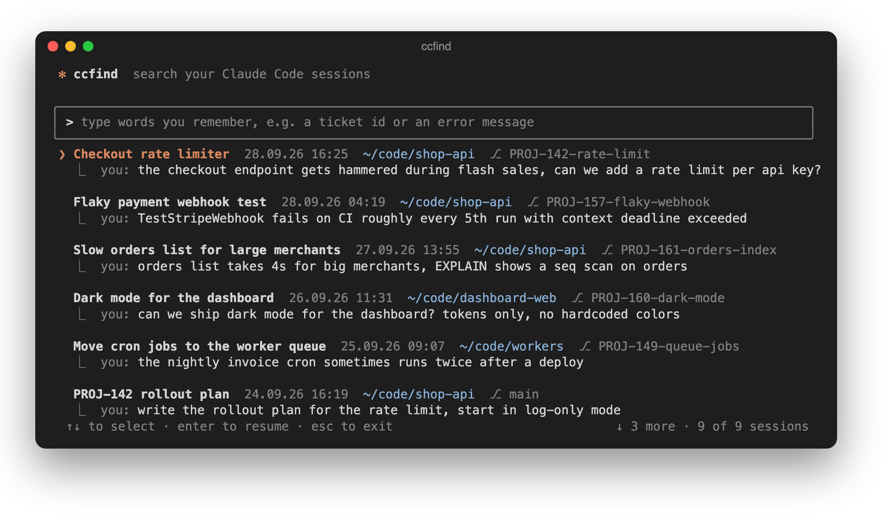
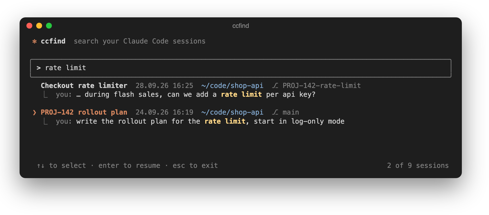

# ccfind

Find an old Claude Code session by a word you remember, and jump back into it.

You closed the session days ago. You remember a ticket id, an error message, a function name.
Type it, pick the session with the arrow keys, press enter: `ccfind` switches into the directory
the session ran in and runs `claude --resume <id>` for you.





## Install

One Python file, no dependencies (Python 3.8+, macOS or Linux).

```sh
git clone https://github.com/lumix17/ccfind.git
ln -s "$PWD/ccfind/ccfind" ~/.local/bin/ccfind   # or any directory on your PATH
```

## Usage

```sh
ccfind                 # open the picker, type to filter
ccfind PROJ-142        # open it with a query filled in
ccfind -l PROJ-142     # print matches and exit, no UI
```

| Key | Action |
| --- | --- |
| type | filter, every word must appear (case-insensitive) |
| `↑` `↓` / `Ctrl-P` `Ctrl-N` | select |
| `PgUp` `PgDn` | page |
| `Enter` | resume the selected session |
| `Ctrl-U` / `Ctrl-W` | clear the query / delete a word |
| `Esc` / `Ctrl-C` | quit |

Sessions whose title matches the query come first, the rest are ordered by their last message.

## How it works

Claude Code stores every session as a JSONL transcript under `~/.claude/projects/`. `ccfind` reads them
and searches what you would remember:

- your messages and Claude's answers
- tool calls (commands, queries, file edits) and the first part of each tool result
- subagent transcripts, counted towards the session that spawned them

System reminders are skipped, otherwise the memory and CLAUDE.md text that rides along in every session
would make every search match everything.

The parsed text is cached in `~/.cache/ccfind/index.pkl`. The first run indexes everything (a few seconds
for a couple of thousand sessions), after that only changed transcripts are re-read and the picker opens
in about half a second. Delete the file to rebuild it.

Resuming goes through your interactive shell, so a `claude` alias with your usual flags still applies.
Nothing leaves your machine.

## License

MIT
